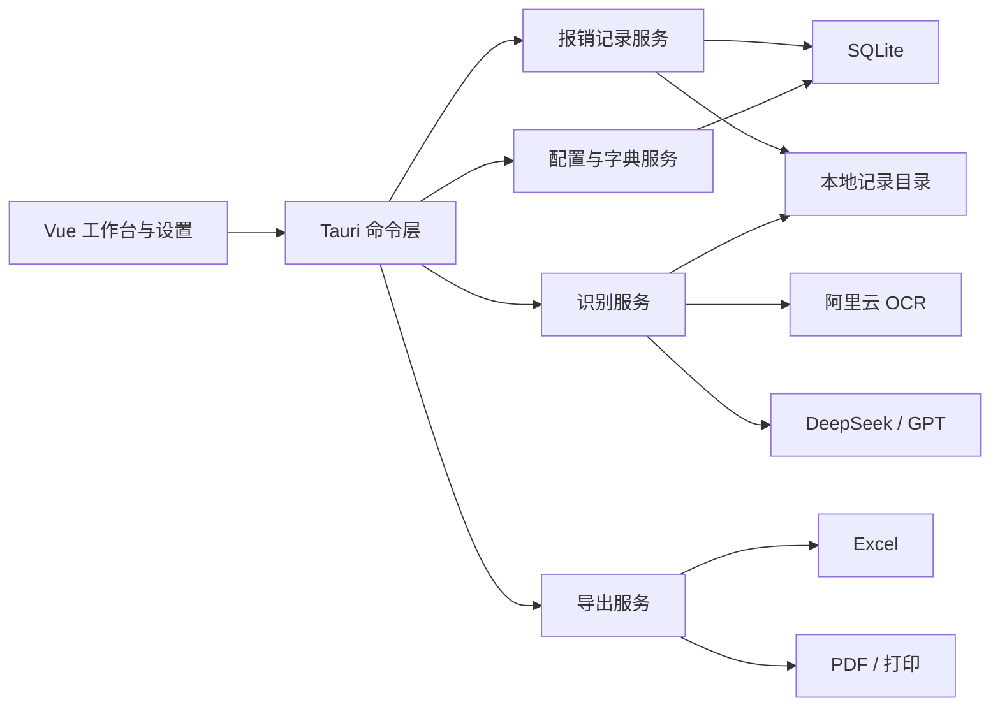

# SheepFinance 开发设计文档

> 文档版本：v0.1  
> 编制日期：2026-08-07  
> 当前阶段：需求确认与技术设计  
> 参考模板：`文档/参考报销单.xlsx`  
> 模板 SHA-256：`1B1397D8D51AD4121D4B166E044745E5CE4AD61F102619503D989A3462C1BA2A`

## 实现进度注记（2026-08-10）

当前代码已覆盖固定模板工作台、手工编辑、图片排版、Excel 导出、应用内打印、识别命令层和应用数据目录 JSON 持久化。阿里云 OCR 使用 `RecognizeAdvanced`/`RecognizeHandwriting` 两个 Action，并由 Rust 完成 ACS3-HMAC-SHA256 签名；大模型使用 OpenAI 兼容 `chat/completions` 请求。真实密钥、脱敏样本、WPS 打印和 Win10 干净环境尚未联调，因此设计中的准确率、耗时和完整发布验收仍保持未完成状态。

首版当前明确不承诺：PDF 导出、SQLite 迁移、API 密钥 DPAPI 保护、导出历史查看、WPS 像素级打印一致性。应用打印以右侧 A4 预览为准，Excel 供 WPS 打开、留档和交接。

## 1. 项目定位

SheepFinance 是一款面向行政、财务等人员的 Windows 本地报销单据整理工具。软件在本机完成图片管理、字段编辑、A4 排版、记录归档、Excel/PDF 生成，仅在调用 OCR 或大模型 API 时联网。

首版目标不是替代 WPS，而是减少从票据截图中抄录信息、汇总金额和排版附件的重复工作。应用内 A4 预览作为正式打印依据，导出的 Excel 主要用于留档和交接，PDF 用于打印和发送。

## 2. 已确认的首版范围

### 2.1 运行与分发

- 支持 Windows 10 x64。
- 使用离线安装包分发，不要求开发环境。
- 目标电脑安装 WPS 个人版，但应用不依赖 WPS 自动化接口。
- 用户通过“另存为”选择导出位置，软件不自动打开 WPS 或 Excel。
- 除 OCR/大模型请求外，其余功能可离线使用。

### 2.2 报销单规则

- 一张图片对应一笔费用。
- 一张报销单包含 1 至 5 笔费用，即最多上传 5 张图片。
- 每笔费用在 Excel 表格中占一行。
- 左侧费用列表顺序即表格序号和右侧图片自动排版顺序。
- 删除、拖动排序后，表格、合计和右侧预览立即同步。
- 金额默认自动合计，允许用户手动覆盖总金额。
- 人民币大写金额由软件根据最终合计金额生成。
- 所有识别结果都允许用户确认和修改。
- AI 负责提取“内容说明”的关键内容，打印版控制长度，完整 OCR 原文保留在记录详情中。

### 2.3 图片能力

- 支持文件选择、拖入以及上传区域获得焦点后的 `Ctrl+V` 图片粘贴。
- 支持 PNG、JPEG 等阿里云 OCR 接口允许的常见格式。
- 支持裁剪、90 度旋转、拖动、等比例缩放和删除。
- 原图永久保留；识别、预览和导出使用派生副本，不覆盖原图。
- 超过接口限制的图片自动生成压缩副本，目标文件不超过 8 MB，并根据实际请求编码方式预留安全余量。

## 3. Excel 模板分析与字段映射

当前模板为单工作表 `报销单`，有效表格位于 `A1:F10`。模板已经清除历史票据和个人数据，不包含图片、公式或隐藏业务工作表。

模板中的 `x/xx/xxx` 均表示需要由软件填写，或需要提供人工修改能力的动态内容。

| 模板区域 | 模板内容 | 软件字段 | 来源与规则 |
| --- | --- | --- | --- |
| `A1:F1` | `xxxx有限公司费用报销单` | `companyName` | 设置中的公司名称，报销单内可修改 |
| `A2:C2` | `报销日期：xxxxx` | `reimbursementDate` | 默认当天，可选择其他日期 |
| `D2` | `申请人：xxx` | `applicantName` | 默认资料对象带出，可修改 |
| `E2` | `所属部门：xxxx` | `departmentName` | 默认资料对象带出，可修改 |
| `F2` | `附票据（x）张` | `attachmentCount` | 根据费用条数自动计算，范围 1 至 5 |
| 费用行 A 列 | 序号 | `sortOrder` | 根据左侧列表顺序自动生成 |
| 费用行 B 列 | 发生日期 | `occurredDate` | AI 提取，可人工修改 |
| 费用行 C 列 | 事由 | `reasonName` | AI 只能从启用的事由字典中选择，用户可重新选择 |
| 费用行 D 列 | 内容说明、参与人员等 | `description` | AI 提取关键内容，用户可编辑 |
| 费用行 E 列 | 安排人 | `arrangerName` | 从安排人字典中选择 |
| 费用行 F 列 | 金额 | `amountCents` | AI 提取，以“分”为单位保存，用户可修改 |
| 合计第一行 | 小写合计 | `effectiveTotalCents` | 默认等于各费用金额之和，可人工覆盖 |
| 合计第二行 | 人民币大写 | `totalAmountUppercase` | 根据最终合计本地计算 |
| 收款信息行 | 名称、账号、开户行 | `paymentInfo` | 默认资料对象带出，可修改 |
| 审批区域 | 部门负责人、财务、总经理审核 | 固定文本 | 首版不编辑 |

模板当前展示 2 条费用行。程序必须按相同列宽、边框、字体和对齐方式动态生成 1 至 5 条费用行，并将合计、收款信息和审批区域整体下移或上移。模板中的宋体、列宽、行高、A4 纵向和页边距作为视觉基准。

### 3.1 Excel 合计规则

- 未人工覆盖合计时，Excel 小写合计写入 `SUM` 公式。
- 人工覆盖合计时，Excel 写入覆盖后的数值，本地记录同时保留自动合计和覆盖值。
- 大写金额单元格引用小写合计，并沿用模板的人民币大写数字格式。
- 金额禁止使用浮点数持久化，统一保存为整数“分”。

## 4. 核心业务模型

### 4.1 默认资料对象

“申请人、所属部门、收款信息”不是三个互不相关的字典，而是一个组合资料对象：

```text
默认资料对象
├─ 申请人
├─ 所属部门
├─ 收款名称
├─ 收款账号
└─ 开户行
```

- 可新增、编辑、停用和删除多个资料对象。
- 同一时间只能有一个默认对象。
- 新建报销单时复制默认对象的当前值作为报销单快照。
- 后续修改设置中的默认对象，不得修改历史报销单。
- 报销单内允许临时修改快照，但不自动回写字典。

### 4.2 字典

- `expense_reason`：办公费、招待费、差旅费、固定资产等，可维护排序和启用状态。
- `arranger`：安排人列表，可维护排序和启用状态。
- 已被历史记录使用的字典项停用后仍需正常显示，不能导致历史数据丢失。

### 4.3 报销单与费用项

- 报销单保存公司名称、报销日期、资料快照、自动合计、人工覆盖合计、状态和创建/更新时间。
- 费用项保存稳定 ID、排序号、发生日期、事由、内容说明、安排人、金额、识别状态和人工修改状态。
- 图片附件与费用项一对一绑定，保存原图、识别副本、尺寸、哈希、裁剪、旋转和 A4 排版数据。
- 排序依赖稳定 ID 和 `sortOrder`，不能通过数组下标关联图片，防止异步识别返回后填错行。

### 4.4 识别值与人工值

每个可识别字段至少保存：

- `recognizedValue`：最近一次 OCR/AI 识别值；
- `currentValue`：界面和导出实际使用值；
- `isUserEdited`：用户是否修改过；
- `confidence`：模型置信提示，可为空；
- `evidence`：对应 OCR 原文片段，可为空。

重新识别时：未人工修改的字段自动更新；人工修改过的字段不覆盖，只展示新旧差异并让用户选择。

## 5. 用户界面与交互

### 5.1 页面结构

- 顶部工具栏：新建、保存、另存为、历史记录、设置。
- 左侧工作区：上传入口、OCR 模式、费用列表、识别状态和费用字段。
- 右侧工作区：固定比例的 A4 可编辑预览。
- 设置页：公司名称、默认资料、事由字典、安排人字典、OCR 配置、大模型配置和数据目录。

界面使用安静、清晰的办公软件风格，重点保证信息密度、可扫描性和重复操作效率，不采用营销式首页。

### 5.2 上传与粘贴

- 上传区被点击后进入可粘贴状态，并有明确焦点样式。
- `Ctrl+V` 时只处理剪贴板中的图片；没有图片时给出非阻塞提示。
- 上传达到 5 张后禁用继续上传，删除后恢复。
- 每次上传立即创建费用项，再异步执行预处理、OCR 和 AI 提取。
- 删除正在识别的费用项时取消请求；无法取消时也必须丢弃迟到结果。

### 5.3 左侧费用列表

每行至少展示缩略图、序号、日期、事由、金额、识别状态和异常提示。支持：

- 拖动排序；
- 点击选中并定位右侧图片；
- 展开或直接编辑字段；
- 切换 OCR 模式后重新识别；
- 删除并短暂提供撤销；
- 查看 OCR 原文和 AI 返回依据。

### 5.4 A4 编辑器

- 使用统一的毫米坐标系描述 A4、表格、文字和图片位置。
- 屏幕缩放只改变显示比例，不改变实际打印坐标。
- 点击日期、申请人、部门、事由、说明、安排人、金额和收款信息时，原地显示对应编辑控件。
- 事由和安排人使用下拉选择；日期使用日期选择器；金额使用两位小数输入；说明使用限制行数的文本编辑器。
- 选中图片后显示缩放、旋转、裁剪和删除工具。
- 图片越界、分辨率过低、内容过小或表格文本溢出时显示警告。

### 5.5 图片自动布局

- 1 张：单张居中，优先保证宽度和清晰度。
- 2 张：两列布局。
- 3 张：上二下一或根据长宽比自适应。
- 4 张：二乘二布局。
- 5 张：二加三或三加二布局。
- 用户手动调整后保存相对槽位的偏移、缩放、裁剪和旋转；重新排序时图片随费用项移动到新的顺序槽位。

首版始终限制为一页 A4。系统负责提示风险，不承诺 5 张超长票据在不裁剪的情况下仍然清晰；用户可调整图片或拆成多张报销单。

## 6. OCR 与大模型流程

### 6.1 OCR 模式

- 默认模式：阿里云 OCR“全文识别高精版”，接口 `RecognizeAdvanced`。
- 手写模式：勾选“手写体识别”后调用 `RecognizeHandwriting`。
- OCR 模式记录在每笔费用上，允许针对单条费用切换后重新识别。

参考文档：

- [阿里云通用文字识别](https://help.aliyun.com/zh/ocr/product-overview/common-character-recognition-1)
- [全文识别高精版 RecognizeAdvanced](https://help.aliyun.com/zh/ocr/developer-reference/api-ocr-api-2021-07-07-recognizeadvanced)
- [通用手写体识别 RecognizeHandwriting](https://help.aliyun.com/zh/ocr/developer-reference/api-ocr-api-2021-07-07-recognizehandwriting)

### 6.2 图片预处理

1. 读取格式、尺寸、方向和文件大小。
2. 修正 EXIF 方向并统一颜色空间。
3. 保留原图，生成识别副本。
4. 在保证文字清晰的前提下逐级缩放或调整质量。
5. 以接口实际请求限制为准控制大小；若采用 Base64，需要考虑编码膨胀。
6. 记录压缩前后尺寸、耗时和失败原因。

截图优先保留 PNG；照片可转换为高质量 JPEG。不得为了满足大小限制而无提示地生成无法识别的低清图片。

### 6.3 AI 结构化提取

OCR 成功后，将全文、行块和坐标信息连同启用的事由字典传给 DeepSeek 或 GPT。模型只能返回固定 JSON：

```json
{
  "occurredDate": "2026-08-07",
  "reasonName": "办公费",
  "description": "购买办公用品",
  "amount": "128.50",
  "confidence": {
    "occurredDate": 0.95,
    "reasonName": 0.82,
    "description": 0.86,
    "amount": 0.98
  },
  "evidence": {
    "amount": "实付 128.50元"
  }
}
```

- `reasonName` 必须来自传入字典；无法判断时返回空值，不能自造分类。
- `description` 提取关键内容，暂按最多 3 行设计，具体字符数由真实模板验证后确定。
- 金额先作为字符串接收，校验后转换为整数分。
- 日期、金额和 JSON 结构校验失败时不得自动填入错误值。
- AI 失败不阻塞手工录入和导出，OCR 原文仍可查看。

### 6.4 配置模型

- 阿里云 OCR 配置：名称、服务地址/区域、AccessKey ID、AccessKey Secret、超时、启用状态。
- 大模型配置：名称、协议类型、Base URL、API Key、模型、超时、启用状态。
- 支持保存多套配置并快速切换，同类配置只能有一个默认值。
- 每次识别记录实际使用的配置、模型、耗时和错误码。
- 业务数据首版不加密；API 密钥仍应使用 Windows DPAPI 或系统凭据保护，日志不得输出密钥。

## 7. 技术架构

### 7.1 技术选型

| 层级 | 推荐技术 |
| --- | --- |
| 桌面框架 | Tauri 2 |
| 前端 | Vue 3、TypeScript、Vite、Pinia、Element Plus |
| A4 与图片编辑 | Konva.js，编辑时使用 HTML 输入控件覆盖画布 |
| 后端 | Rust、Serde、Tokio、Reqwest |
| 本地数据库 | SQLite，Rust 服务层统一访问 |
| 图片处理 | Rust `image` 或等价稳定库，前端 Canvas 负责交互裁剪 |
| Excel 输出 | `rust_xlsxwriter`，按参考模板规格生成标准 `.xlsx` |
| PDF 输出 | 以 300 DPI 渲染 A4 画布，再封装为单页 PDF |
| 日志 | 结构化滚动日志，敏感字段脱敏 |
| 安装包 | Tauri NSIS，处理 WebView2 离线安装条件 |

### 7.2 模块关系



前端不能直接持有阿里云或大模型密钥。所有签名、请求、重试、超时和响应校验由 Rust 后端完成。

## 8. 本地存储设计

默认数据目录建议使用 `%LOCALAPPDATA%/SheepFinance/`：

```text
SheepFinance/
├─ data.db
├─ records/
│  └─ {recordId}/
│     ├─ original/
│     ├─ processed/
│     ├─ recognition/
│     └─ exports/
├─ logs/
└─ backups/
```

建议数据表：

- `app_settings`：公司名称、数据目录、通用设置；
- `reimbursement_profiles`：申请人、部门和收款信息组合对象；
- `dictionary_items`：事由、安排人等字典；
- `ocr_profiles`：OCR 配置；
- `llm_profiles`：大模型配置；
- `reimbursement_records`：报销单主记录；
- `expense_items`：费用项；
- `attachments`：图片及排版数据；
- `recognition_runs`：OCR/AI 请求状态、耗时和原始结果路径；
- `export_history`：导出格式、路径、时间和结果；
- `operation_logs`：关键业务操作。

原图和原始响应适合存文件，SQLite 保存索引、状态和相对路径，避免数据库无限膨胀。保存记录时采用事务；应用异常退出后能够恢复最近草稿。

## 9. Excel、PDF 与打印

### 9.1 Excel

- 以参考模板的字体、列宽、行高、边框、合并单元格和文案为基准重新生成干净工作表。
- 根据费用数量动态生成 1 至 5 行。
- 设置 A4 纵向、固定打印区域、适合一页宽和一页高。
- 嵌入经过裁剪和旋转处理后的图片副本。
- 图片位置尽量接近应用预览，但首版不承诺与 WPS 像素级一致。
- 输出只包含当前报销单，不包含配置、日志、OCR 原文或其他历史记录。

### 9.2 PDF 与打印

- A4 编辑器和 PDF 使用同一份文档模型和坐标。
- 导出时按 300 DPI 生成一页 A4，确保票据文字尽量清晰。
- 应用打印以该 PDF/画布结果为准。
- Excel 在 WPS 中被再次修改后，不要求与先前 PDF 同步。

### 9.3 另存为

- `另存为 Excel`：系统文件对话框选择 `.xlsx` 路径。
- `另存为 PDF`：系统文件对话框选择 `.pdf` 路径。
- `同时导出`：选择目录，生成同名 Excel 和 PDF。
- 默认文件名：`yyyy-MM-dd_申请人_合计金额`，用户可修改。

## 10. 异常处理

- 图片格式或大小不支持：保留费用项并提示重新选择，不产生空白识别记录。
- OCR 失败：允许重试、切换手写模式或手工填写。
- AI 失败或 JSON 无效：显示 OCR 原文，费用项进入“待人工完善”。
- 网络中断：识别任务失败但草稿不丢失，其他本地功能继续可用。
- 排序或删除发生在识别期间：使用费用项 ID 和请求版本号避免迟到响应污染其他行。
- 导出失败：保留草稿和临时文件信息，错误日志不包含密钥和完整敏感请求头。
- 原图丢失：历史记录显示缺失状态，不能静默导出空白附件。

## 11. 首版非目标

- 不支持多套 Excel 模板切换或模板设计器。
- 不支持多页报销单自动分页。
- 不支持多人协作、审批流和云同步。
- 不支持发票真伪查验。
- 不支持完全离线 OCR。
- 不依赖或自动控制 WPS/Excel。
- 不实现应用登录、数据库密码或完整业务数据加密。

## 12. 首版验收标准

1. 在 Windows 10 x64 安装后可独立启动，目标电脑仅需满足 WebView2 运行条件。
2. 可通过文件、拖入和聚焦上传区后粘贴图片，最多 5 张。
3. 一张图片稳定绑定一条费用，排序和删除不会导致数据错位。
4. 两种阿里云 OCR 模式可以按选择调用，失败可重试。
5. OCR 结果可以交给配置的大模型，并通过固定结构填入日期、事由、说明和金额。
6. 所有动态字段可按本设计编辑，人工修改在重新识别后不会被静默覆盖。
7. 事由和安排人来自可维护字典；新建报销单自动带出唯一默认资料对象。
8. 合计、人工覆盖合计和人民币大写金额结果正确。
9. 右侧 A4 支持文字编辑、图片裁剪/旋转/拖动/缩放/删除及越界提示。
10. 关闭并重新打开应用后，记录、原图、识别依据和排版能够恢复。
11. 能另存为单页 PDF 和可由 WPS 个人版打开的 Excel。
12. Excel 仅包含当前报销单，打印设置为 A4 纵向单页，不携带历史数据。

## 13. 开发前仍需准备的业务数据

以下内容不阻塞项目搭建，但应在 OCR/AI 联调前提供：

- 公司名称默认值；
- 首批事由字典完整列表；
- 首批安排人字典；
- 至少一个脱敏默认资料对象；
- 正常发票、交通票据、机打票据、购物小票、支付宝/微信截图等脱敏样本；
- 对每张样本人工标注的日期、事由、说明和金额，供准确率对比。
